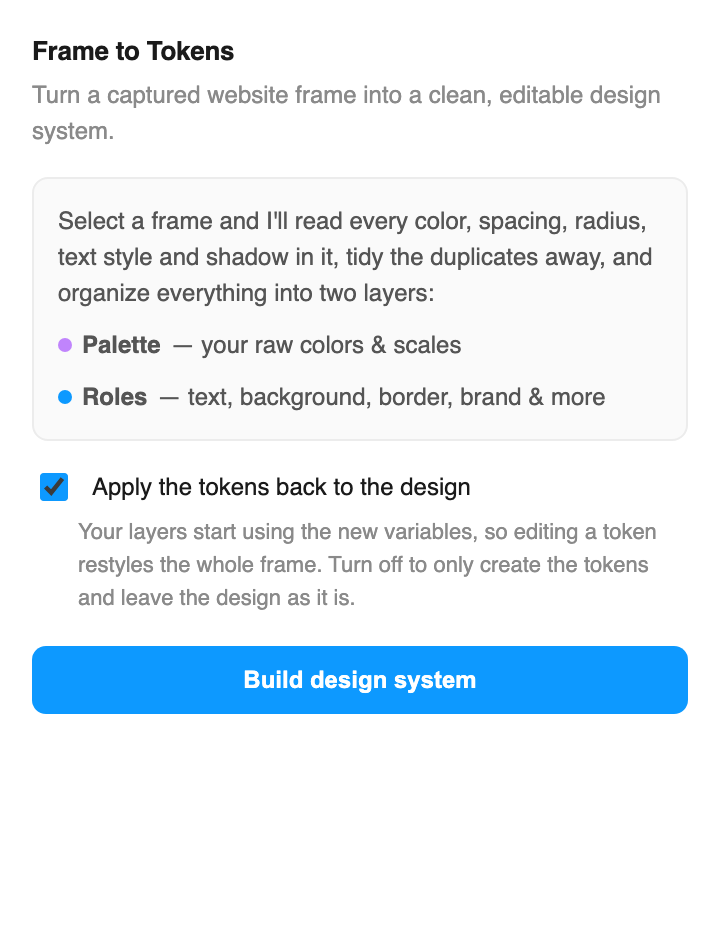
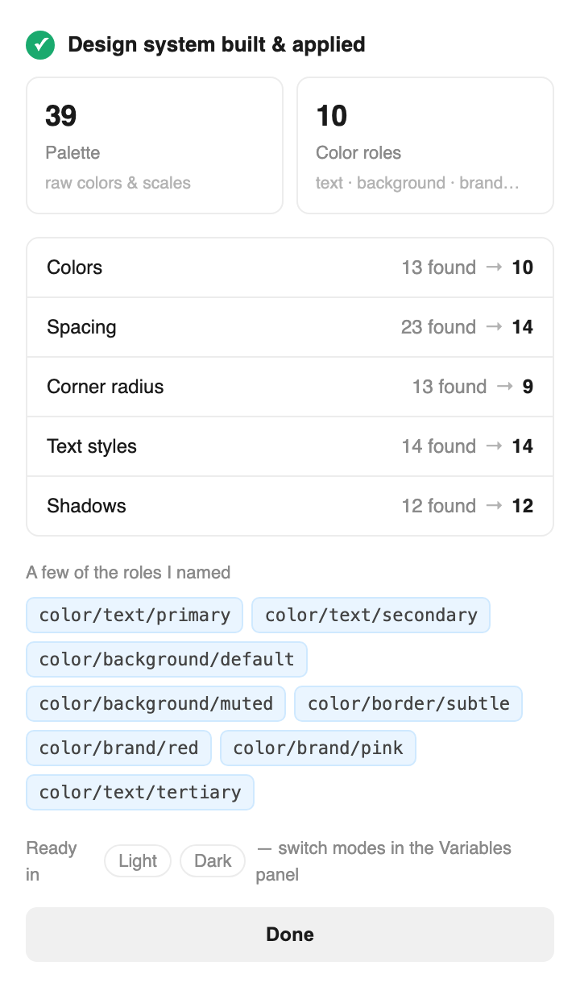

# Frame to Tokens

A Figma plugin that turns a captured web frame into a real design system — **Variables + Styles**, not just layers.

> **Free & open-source (MIT).** Figma's new web-capture extension gives you editable layers but stops there — every value hardcoded, no Variables, no Styles. This is the missing layer that finishes the job: a free alternative to html.to.design.

| Select a frame | Get a design system |
|---|---|
|  |  |

## Why

In June 2026 Figma shipped an official Chrome extension that captures any live webpage into **editable Figma layers**. It does the hard part (DOM → frames, text, images) for free. But it stops there: every color, spacing, radius and font size lands **hardcoded**. You get a thousand layers and zero system.

`Frame to Tokens` is the layer on top. Point it at a captured frame and it:

1. **Collects** every raw value across the tree (fills, strokes, radii, auto-layout spacing/padding, type, shadows) — and records, for each color, *how* it's used (on text, on a large surface, as a stroke).
2. **Infers a semantic role** for every color from that usage, so you get `color/text/primary`, `color/background/default`, `color/border/subtle`, `color/brand/*` — not `color/gray-7`.
3. **Clusters** near-duplicates into a tight token set — barely-different greys from anti-aliased CSS collapse together; arbitrary pixel paddings snap to a 4/8 scale.
4. **Writes** a proper two-tier token system:
   - A **Primitives** collection — the raw palette snapped onto a standard ladder: `Color/Neutral/600`, `Color/Red/400`, plus `spacing/8`, `radius/10`.
   - A **Semantic** collection — `color/text/primary`, `color/background/default`, `color/brand/*` — each one an **alias** to a primitive, never a hardcoded value. Every primitive it points to was actually extracted from the frame.
   - Plus **Text Styles** and **Effect Styles** for type and elevation.
5. **Rebinds** the layers onto the **semantic** tokens (optional) so the whole frame becomes editable through the system.

The capture stays free (Figma's own extension); this plugin runs entirely in the Figma sandbox — no scraping, no hosting, no network.

## Install (30 seconds)

The one-click version is in review on the Figma Community. Until it lands, run it straight from here:

1. **Get the code** — clone this repo, or `Code → Download ZIP` and unzip.
2. In **Figma desktop**: `Plugins → Development → Import plugin from manifest…` → pick `manifest.json` from this folder.
3. Capture a site with Figma's official web-capture extension (or open any frame), select the frame, then run **Plugins → Development → Frame to Tokens**.

That's it. No account, no network, nothing leaves your file.

## How the clustering works

- **Colors** — sorted by usage, merged when within a perceptual distance (`COLOR_THRESHOLD`). Each representative's role is inferred from usage: dominant text use → `color/text/*` (ranked dark→light: primary, secondary, tertiary); strokes → `color/border/*`; near-white/near-black and large fills → `color/background/*` (ranked light→dark: default, subtle, muted, strong); chromatic accents → `color/brand/*`. Validated on an Airbnb capture, it surfaced `#FF385C` — Airbnb's actual brand red — as `color/brand`.
- **Spacing / radii** — snapped to the nearest 4 or 8, deduped, named by value so the scale reads small → large.
- **Type** — unique (family, style, size, line-height) combos become Text Styles, named by size role (`display`, `heading`, `title`, `body`, `caption`).
- **Shadows** — deduped into an `elevation/*` effect-style ramp.

## Status

v0.1 — proof of concept. Known next steps: merging against an existing library instead of a fresh collection, smarter handling of gradients and image fills.
